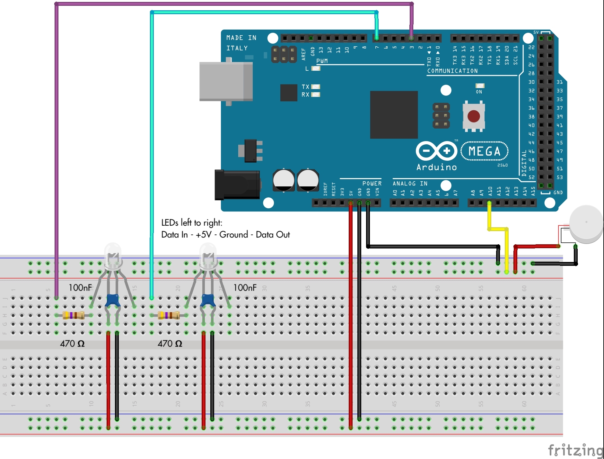
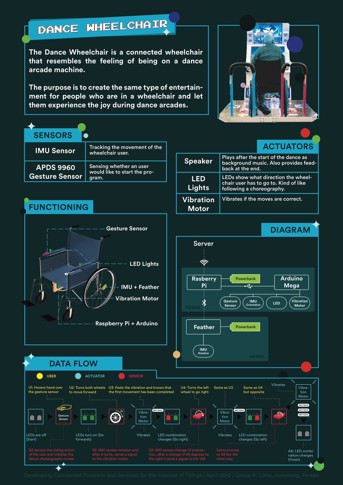

# Dance Wheelchair
In this document the functioning of the Internet-connected Wheelchair called Dance Wheelchair will be explained. This internet-connected wheelchair lets wheelchair users dance in the same way that is being done at a gaming arcade hall. Just as the game screen shows different arrow keys for people to step on the dance platform, LED light signals of Dance Wheelchair  guide the user which direction to move, giving her/him cues to choreograph the dance. If the user moves correctly, she/he is notified with brief vibration and gets next dance cue from the LED lights. In this way, people on a wheelchair can enjoy their own DANCE DANCE REVOLUTION!

1. [Components/Hardware](#1-Components/Hardware)
2. [Software](#2-Software)
3. [Assembling the wheelchair](#3-Assembling-the-Wheelchair)
4. [Libraries](#4-Libraries)
5. [Code](#5-Code)
6. [Wiring](#6-Wiring)
7. [Poster](#7-Poster)


## 1. Components/Hardware
- Any Wheelchair
- Two Pieces of Thin Ply Wood
- +- 1 Meter of Velcro
- +- 6 Cable Ties
- Tape
- 1 Raspberry Pi
- 1 Adafruit Bluefruit Feather
- 1 Arduino Mega 2560
- 1 Small Powerbank
- 1 Big Powerbank
- +- 10 male to male jumper wires
- 1 big breadboard
- 1 small breadboard
- 1 Vibration Motor
- 2 Neopixel LEDs
- 2 Condensators
- 2 Resistors of 470Ω

## 2 Software
Software used for this course:
1. Atom
2. Arduino IDE
3. Terminal (macOS): Connecting to the Raspberry Pi without monitor
4. Github: Team documentation
5. DCD Hub: Grafana
6. Raspbian ([downoad here](https://www.raspberrypi.org/downloads/raspbian/))
7. Etcher: To flash the Raspberry Pi


## 3 Assembling the wheelchair
By using two pieces of plywood and applying these to the frame of the wheelchair, a space is created to add the Raspberry Pi, Arduino Mega and a big powerbank. For your own convenience: Make sure to attach the plywood to the frame in a way that the wheelchair is still foldable.

The feather + small breadboard and a small powerbank are attached to a spoke of the wheel to detect the rotation. First check part 5 [here](#6-Wiring) to wire the feather correctly on the small breadboard. Check part 4 for the code to flash on the feather. If the wiring is correct and the right code flashed, you can use cable ties and tape to fix these components to the wheelchair. The assembly of the wiring can be found [here](#6-Wiring) whereas an overview of the wheelchair with its components can be found [here](#7-Poster).

## 4 Libraries
The following libraries need to be installed in order to successfully run the code. In the code you can find the comments to what the code does and how it works.

<details><summary>Python libraries</summary>
<p>
```python
import pygatt  # To access BLE GATT support
import signal  # To catch the Ctrl+C and end the program properly
import os  # To access environment variables
from dotenv import load_dotenv  # To load environment variables from .env file
import serial
import time
import random # to generate random movements

# DCD
from dcd.entities.thing import Thing
from dcd.entities.property_type import PropertyType
```
</p>
</details>

<details><summary>Feather Libraries</summary>
<p>
```C
#include <Arduino.h>
#include <SPI.h>
#include <Wire.h>
#include <Adafruit_Sensor.h>
#include <Adafruit_BNO055.h>
#include <utility/imumaths.h>
#include "Adafruit_BLE.h"
#include "Adafruit_BluefruitLE_SPI.h"
#include "Adafruit_BluefruitLE_UART.h"

#include "BluefruitConfig.h"

#if SOFTWARE_SERIAL_AVAILABLE
  #include <SoftwareSerial.h>
#endif

#include "BluefruitConfig.h"
```
</p>
</details>

<details><summary>Arduino Libraries</summary>
<p>
Download Adafruit Neopixel library to control the LEDs.

```C
#include <Adafruit_NeoPixel.h>
```
</p>
</details>

## 5 Code
<details><summary>Code for Raspberry pi</summary>
<p>

```python
#!/usr/bin/env python3

# In this example, we connect to a GATT service 'rotation' on the wheel, sending
# the rotation count over time. We create a random movement which needs to be executed by the user.
# When we reach the recommended number of rotations,
# we send a command to the Arduino to turn on the vibration motors for 2 seconds and to
# color the LED's correctly for the next movement.
# This code is based on the example code created by Jacky

# Import required library
import pygatt  # To access BLE GATT support
import signal  # To catch the Ctrl+C and end the program properly
import os  # To access environment variables
from dotenv import load_dotenv  # To load environment variables from .env file
import serial
import time
import random

# DCD Hub
from dcd.entities.thing import Thing
from dcd.entities.property_type import PropertyType

# The thing ID and access token
load_dotenv()
THING_ID = os.environ['THING_ID']
THING_TOKEN = os.environ['THING_TOKEN']
BLUETOOTH_DEVICE_MAC = os.environ['BLUETOOTH_DEVICE_MAC']

# UUID of the GATT characteristic to subscribe
GATT_CHARACTERISTIC_ROTATION = "02118733-4455-6677-8899-AABBCCDDEEFF"

# Many devices, e.g. Fitbit, use random addressing, this is required to connect.
ADDRESS_TYPE = pygatt.BLEAddressType.random

# Recommended number of rotation
RECOMMENDED_NUM_ROTATION = 1

# Did we already nudged
nudged = False

# points are used to keep track of the amount of correctly executed movements
points = 0

# the first value is saved to be used as starting point
first_values = [0,0]
is_first_value = True

# Start reading the serial port
ser = serial.Serial(
    port = os.environ['SERIAL'],
    baudrate = 9600,
    timeout = 2)


def find_or_create(property_name, property_type):
    """Search a property by name, create it if not found, then return it."""
    if my_thing.find_property_by_name(property_name) is None:
        my_thing.create_property(name=property_name,
                                 property_type=property_type)
    return my_thing.find_property_by_name(property_name)


def handle_rotation_data(handle, value_bytes):
    """
    handle -- integer, characteristic read handle the data was received on
    value_bytes -- bytearray, the data returned in the notification
    """
    print("Received data: %s (handle %d)" % (str(value_bytes), handle))

    rotation_values = [float(x) for x in value_bytes.decode('utf-8').split(",")]
    find_or_create("dance",
                   PropertyType.TWO_DIMENSIONS).update_values(rotation_values)

    # this function generates a random movement and checks if the user completed the movement
    check_movement(rotation_values)

def keyboard_interrupt_handler(signal_num):
    """Make sure we close our program properly"""
    print("Exiting...".format(signal_num))
    left_wheel.unsubscribe(GATT_CHARACTERISTIC_ROTATION)
    exit(0)

def check_movement(rotation_values):
    global is_first_value, first_values, points
    print("point count:", points)
    if is_first_value == True:
        first_values = rotation_values
        random_movement = random.randint(0,1)
        is_first_value = False

    # Start movements
    global random_movement
    dif_forward = rotation_values[0]-first_values[0]
    dif_reverse = rotation_values[1]-first_values[1]

    # Check if user has made the right movement
    if random_movement == 0:
        # tell the user what move to make:
        print("move FORWARD")
        # send sign to the arduino via serial to turn both LED's green
        ser.write('0'.encode())
        # if rotation reached threshhold:
        if (dif_forward) > RECOMMENDED_NUM_ROTATION:
            # send sign to arduino to turn on vibration motor for 2 seconds
            ser.write('4'.encode())
            time.sleep(2)
            global points
            points+=1
            # set current values as starting point of next movement
            first_values = rotation_values
            # generate new random movement
            random_movement = random.randint(0,1)

    elif random_movement == 1:
        # tell the user what move to make:
        print ("move BACKWARD")
        # send the sign to the arduino via serial to turn both LED's red
        ser.write('1'.encode())
        # if rotation reached threshhold:
        if (dif_reverse) > RECOMMENDED_NUM_ROTATION:
            # send sign to arduino to turn on vibration motor for 2 seconds
            ser.write('4'.encode())
            time.sleep(2)
            global points
            points+=1
            # set current values as starting point of next movement
            first_values = rotation_values
            # generate new random movement
            random_movement = random.randint(0,1)

    else :
        exit(0)

# Instantiate a thing with its credential, then read its properties from the DCD Hub
my_thing = Thing(thing_id=THING_ID, token=THING_TOKEN)
my_thing.read()

# Start a BLE adapter
bleAdapter = pygatt.GATTToolBackend()
bleAdapter.start()

# Use the BLE adapter to connect to our device
left_wheel = bleAdapter.connect(BLUETOOTH_DEVICE_MAC, address_type=ADDRESS_TYPE, timeout = 100.0)

# Subscribe to the GATT services
left_wheel.subscribe(GATT_CHARACTERISTIC_ROTATION, callback=handle_rotation_data)

# Register our Keyboard handler to exit
signal.signal(signal.SIGINT, keyboard_interrupt_handler)

```
</p>
</details>
### 5.2. Code for Adafruit Bluefruit feather

<details><summary>Arduino mega code:</summary>
<p>
This code enabled Arduino Mega to receive signals from Raspberry Pi through its serial port and actuates 2 LED lights and the vibration motor.
```C
#include <Adafruit_NeoPixel.h> // Necessary Library include

#define LED_PIN1 2 // Defining the left LED
#define LED_PIN2 7 // Defining the right LED
#define VIB_PIN A10 // Defining Vibration Motor

Adafruit_NeoPixel LED_controller1 = Adafruit_NeoPixel( 1, LED_PIN1, NEO_RGB + NEO_KHZ800);
Adafruit_NeoPixel LED_controller2 = Adafruit_NeoPixel( 1, LED_PIN2, NEO_RGB + NEO_KHZ800);

int i = 127;
uint8_t R = 0, G = 0, B = 0; // Unsigned integer with 8 bits
uint32_t counter = 0; // 32 bits unsigned integer, we only need 24 to go through all the colors

bool left_red = false;
bool right_red = false;

void setup() {
  Serial.begin(9600); //Set serial to 9600 baud
  pinMode(VIB_PIN, OUTPUT);
  LED_controller1.begin(); // We're starting up the library for the left LED
  LED_controller2.begin(); // We're starting up the library for the right LED

  LED_controller1.setPixelColor( 0, 0x008000);
  LED_controller2.setPixelColor( 0, 0x008000);
  // Red = 0xFF0000 and Green = 0x008000
}

void loop() {

  LED_controller1.show(); // Sending updated pixel color to the hardware
  LED_controller2.show(); // Sending updated pixel color to the hardware

  if (Serial.available() > 0 ) {
    int command = Serial.read();
//  int inByte = Serial.read();

    switch (command) {
      // user needs to go forward
      case '0' :
        LED_controller1.setPixelColor( 0, 0x008000);
        LED_controller2.setPixelColor( 0, 0x008000);
        LED_controller1.show();
        LED_controller2.show();
        break;
      //user needs to go backward
      case '1' :
        LED_controller1.setPixelColor( 0, 0xFF0000);
        LED_controller2.setPixelColor( 0, 0xFF0000);
        LED_controller1.show();
        LED_controller2.show();
        break;
      //user needs to go right
      case '2' :
        LED_controller1.setPixelColor( 0, 0xFF0000);
        LED_controller2.setPixelColor( 0, 0x008000);
        LED_controller1.show();
        LED_controller2.show();
        break;
      //user needs to go left
      case '3' :
        LED_controller1.setPixelColor( 0, 0x008000);
        LED_controller2.setPixelColor( 0, 0xFF0000);
        LED_controller1.show();
        LED_controller2.show();
        break;
      //Vibrate the motor
      case '4' :
        analogWrite(VIB_PIN, 153);
        delay(2000);
        analogWrite(VIB_PIN, 0);
        // Add a default state that makes sure the LED lights are shining white.
      default:
        LED_controller1.setPixelColor( 0, 0xFFFFFF);
        LED_controller2.setPixelColor( 0, 0xFFFFFF);
        LED_controller1.show();
        LED_controller2.show();

      }

    }
}
```
</p>
</details>

## 6 Wiring
Wiring Arduino uno, vibration motor and two RGB LEDs

Wiring

## 7 Poster
The poster below shows an overview of the project. Although this project only implemented the IMU Sensor, LED Lights and a vibration motor, the poster shows the use of an extra IMU Sensor and the gesture sensor. Therefore the data flow shows that the user can move forward, backward, to the left and right. In the code given above it is only possible to let the user move forward and backward.


